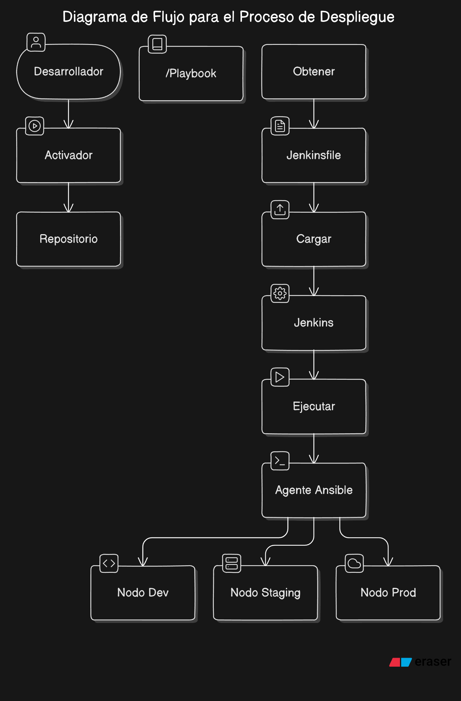

#                                                                            ****DESAFIO 7****
---
# Objetivos del desafío: 
### El objetivo de este desafío es poder unificar lo que fuimos viendo en clases y que ustedes puedan crear su propio pipeline
# Escenario: 
### En nuestro sprint anterior trabajamos en modularizar nuestro proyecto de Ansible, lo cual permitió que ahora más integrantes puedan colaborar en mejorar los procesos y desarrollarnuevas funcionalidades para el playbook. Luego del éxito de este cambio el equipo identificó que existen playbook que solo quedan en el entorno local de los desarrolladores y es por esto que necesita crear un pipeline CI/CD para forzar que la única manera de ejecutar e interactuar de ejecutar los playbook en los distintos entornos sea desde un código que sea leído de un repo y ejecutado desde un controlador de Jenkins. Esta mejora en el proceso busca: 
### ● Aumentar la seguridad ya que las credenciales de acceso solo estarán disponible en el controlador de Jenkins y no será necesario que un desarrollador disponga de las credenciales de forma local.
### ● Permite forzar a los desarrolladores a crear sus entornos de trabajo local evitando que el proceso de desarrollo se ejecute en entornos compartidos.
### ● Todos los cambios podrán ser gestionados como una pieza de software y podrán pasar por un proceso de revisión de PR.
### ● Mantener la estrategia de branches que vienen utilizando: ○ DEV: entorno de desarrollo, es un entorno donde se llevan cambios frecuentes y los miembros del equipo tienen mayor libertad para ver los cambios en equipos reales. ○ STAGING: es un entorno donde se integran y prueban todos los cambios, los miembros del equipo no cuentan con acceso a los equipos y solo reciben feedback mediante las herramientas CI/CD y los cambios son aplicados solo mediante un PR (pull request). ○ MAIN: es nuestro entorno productivo, no contamos acceso y los cambios son desplegados mediante CI/CD y mediante un PR desde staging

## 1. **Diagrama de flujo**

!

